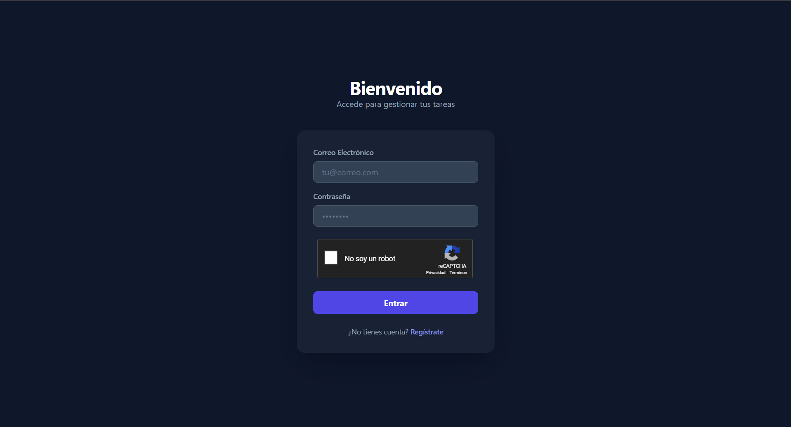
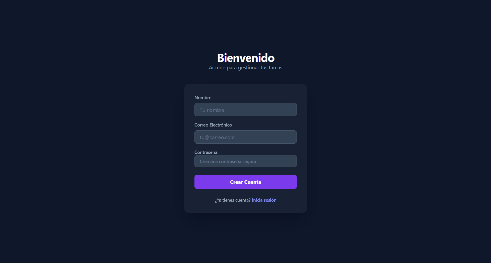
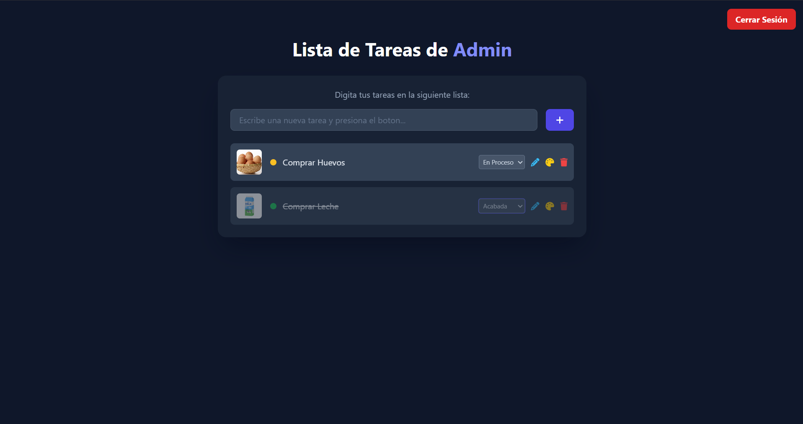
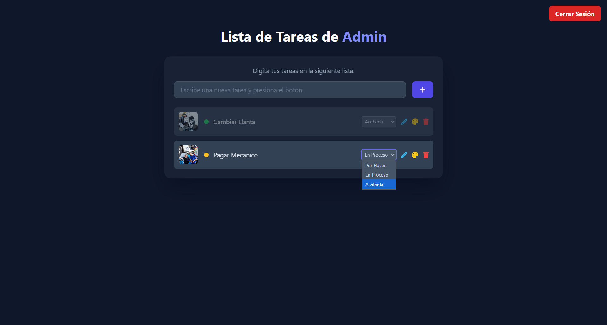

# 📝 Sistema de Gestión de Tareas con Autenticación

## 📋 Descripción del Proyecto

Aplicación web completa que permite a los usuarios registrarse, iniciar sesión y gestionar sus tareas diarias de manera eficiente. El sistema cuenta con autenticación segura mediante reCAPTCHA y una interfaz moderna y responsiva.

## ✨ Características Principales

### 🔐 Sistema de Autenticación
- **Registro de usuarios**: Formulario completo con validación de datos
- **Inicio de sesión**: Acceso seguro con verificación reCAPTCHA
- **Persistencia de datos**: Almacenamiento de usuarios en localStorage
- **Sesión activa**: Control de sesión mediante sessionStorage
- **Validación de duplicados**: Prevención de correos duplicados

### ✅ Gestor de Tareas
- **Crear tareas**: Agregar nuevas tareas con descripción personalizada
- **Imágenes personalizadas**: Cada tarea puede tener una imagen asociada
- **Estados de tareas**:
  - 🔴 Por Hacer
  - 🟡 En Proceso  
  - 🟢 Acabada
- **Editar tareas**: Modificar el texto de tareas existentes
- **Cambiar color**: Personalizar el color de fondo de cada tarea
- **Eliminar tareas**: Borrar tareas completadas o innecesarias

## 🛠️ Tecnologías Utilizadas

- **HTML5**: Estructura semántica de la aplicación
- **CSS3**: Estilos personalizados
- **JavaScript**: Lógica de negocio y manipulación del DOM
- **Tailwind CSS**: Framework CSS para diseño responsivo y moderno
- **Font Awesome**: Iconografía
- **Google reCAPTCHA**: Protección contra bots

## 📁 Estructura del Proyecto

```
proyecto/
│
├── index.html              # Página de login y registro
├── home.html               # Página principal de tareas
│
└── assets/
    ├── js/
    │   ├── form.js         # Lógica de autenticación
    │   └── script.js       # Lógica de gestión de tareas
    │
    └── img/
        └── emoji.jpg       # Imagen por defecto
```

## 🚀 Instalación y Uso

### Requisitos Previos
- Navegador web moderno (Chrome, Firefox, Safari, Edge)
- Conexión a internet (para cargar CDNs)

### Pasos para Ejecutar

1. **Clonar o descargar el proyecto**
   ```bash
   git clone [URL-del-repositorio]
   ```

2. **Abrir el proyecto**
   - Navegar a la carpeta del proyecto
   - Abrir `index.html` en un navegador web

3. **Registrarse**
   - Hacer clic en "Regístrate"
   - Completar el formulario con nombre, correo y contraseña
   - Hacer clic en "Crear Cuenta"

4. **Iniciar Sesión**
   - Ingresar correo y contraseña registrados
   - Completar el reCAPTCHA
   - Hacer clic en "Entrar"

5. **Gestionar Tareas**
   - Escribir una tarea en el campo de texto
   - Hacer clic en el botón "+" para agregar
   - Opcionalmente, agregar una URL de imagen
   - Usar los controles para editar, cambiar estado, color o eliminar

## 📸 Capturas de Pantalla

### Pantalla de Inicio de Sesión

*Interfaz de inicio de sesión con reCAPTCHA*

### Pantalla de Registro

*Formulario de registro de nuevos usuarios*

### Gestor de Tareas

*Interfaz principal con lista de tareas*

### Gestión de Estados

*Diferentes estados visuales de las tareas*

## 🎨 Características de Diseño

- **Tema oscuro**: Interfaz elegante con colores slate
- **Diseño responsivo**: Adaptable a diferentes tamaños de pantalla
- **Animaciones suaves**: Transiciones CSS para mejor experiencia
- **Indicadores de estado**: Códigos de color intuitivos
- **Glassmorphism**: Efectos de cristal esmerilado en los contenedores

## 🔒 Seguridad

- **reCAPTCHA v2**: Protección contra accesos automatizados
- **Validación de campos**: Verificación de datos antes de procesarlos
- **Sanitización de entradas**: Uso de `.trim()` para limpiar datos
- **Control de sesión**: Redirección automática si no hay sesión activa

## 📝 Funcionalidades Detalladas

### Registro (Sign Up)
```javascript
- Validación de campos requeridos
- Verificación de email duplicado
- Almacenamiento en localStorage
- Redirección a login tras registro exitoso
```

### Inicio de Sesión (Login)
```javascript
- Validación de reCAPTCHA
- Verificación de credenciales
- Creación de sesión en sessionStorage
- Redirección a página de tareas
```

### Gestión de Tareas
```javascript
- Agregar: Crea nueva tarea con imagen opcional
- Editar: Modifica el texto de la tarea
- Cambiar estado: Alterna entre Por Hacer, En Proceso, Acabada
- Cambiar color: Personaliza el fondo de la tarea
- Eliminar: Borra la tarea de la lista
```

### Etiquetas
  


---

## Autor 

* **Victor Cordoba** - *Creador y desarrollador principal* - [VoctorX](https://github.com/VoctorX)

---

## Fecha 
* *Octubre 30 del 2025*

---

⭐ **¡Gracias por revisar este proyecto!** ⭐